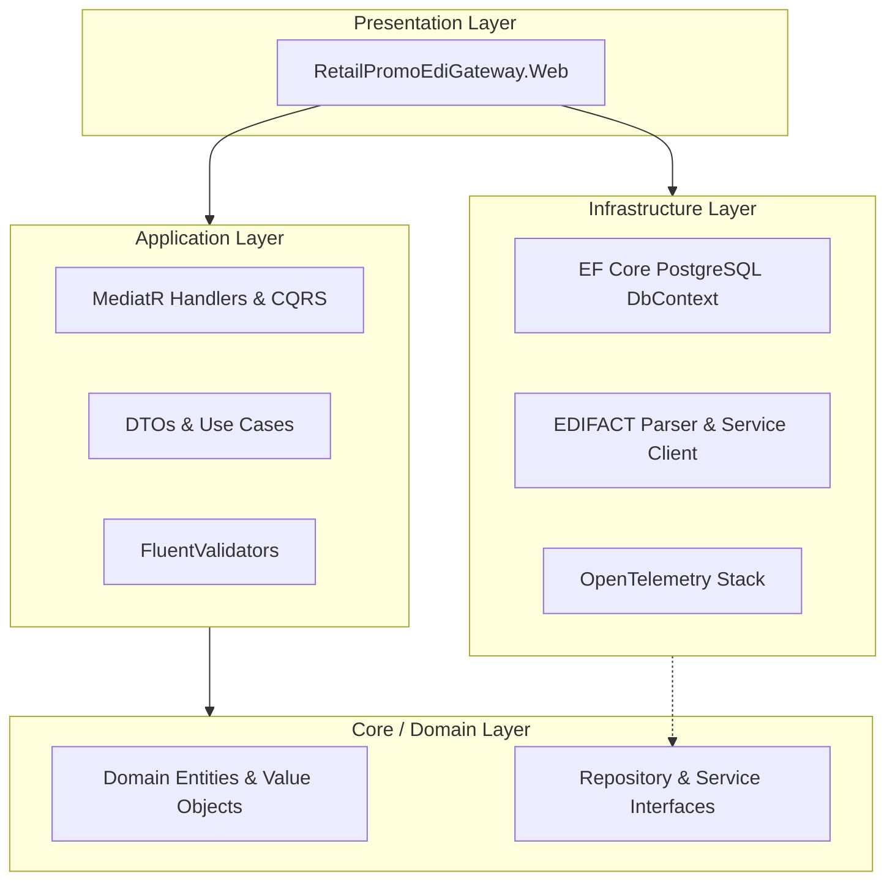
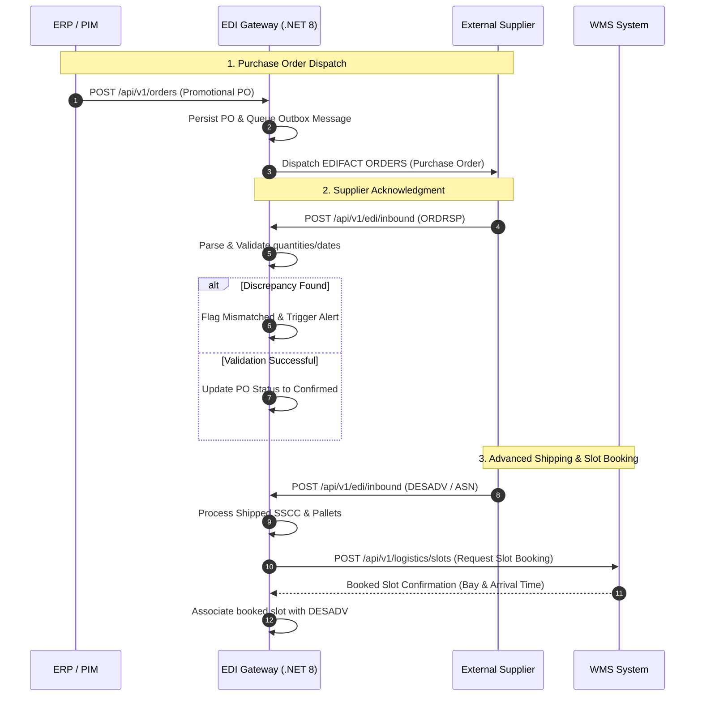

# EDI & Supply Chain Gateway for In & Out Promotions

## 1. Overview
The **EDI & Supply Chain Gateway** is an enterprise-grade integration middleware designed to orchestrate electronic data exchange (EDI) with suppliers, specifically for high-priority temporary "In & Out" promotional campaigns in retail environments.

It automates procurement, tracks shipping notifications, and manages warehouse slots to ensure on-time delivery for time-critical promotional windows.

## 2. Key Features
* **Campaign Tracking Dashboard:** Monitor fulfillment and delivery status of promotional campaigns.
* **PO Processing:** Automate outbound EDI document generation (EDIFACT `ORDERS`).
* **Inbound Message Parsing:** Handle `ORDRSP` (Order Response) and `DESADV` (Despatch Advice) messages.
* **Warehouse Slot Management:** Integrate with WMS to coordinate truck arrival slots.
* **Proactive Alerting:** Flag missing responses, shipping delays, or quantity discrepancies.

## 3. Technology Stack
* **Framework:** .NET 8 (ASP.NET Core MVC)
* **Database:** PostgreSQL with Entity Framework Core (EF Core)
* **Observability:** OpenTelemetry (Prometheus metrics, Grafana logs/traces)
* **Architecture:** Clean Architecture (Core, Application, Infrastructure, Web layers)
* **Logging:** Serilog with structured logging

## 4. Getting Started

### Prerequisites
* **.NET 8 SDK** (Required for building and running)
* **PostgreSQL** (Database system)

### Installation & Setup
1. **Restore dependencies:**
   ```powershell
   dotnet restore RetailPromoEdiGateway.sln
   ```

2. **Build the solution:**
   ```powershell
   dotnet build RetailPromoEdiGateway.sln
   ```

3. **Run tests:**
   ```powershell
   dotnet test RetailPromoEdiGateway.sln
   ```

4. **Run the application:**
   ```powershell
   dotnet run --project src\RetailPromoEdiGateway.Web
   ```

## 5. Project Structure
* `src/RetailPromoEdiGateway.Core`: Domain entities, enums, and core business rules.
* `src/RetailPromoEdiGateway.Application`: Use cases (MediatR), interfaces, and application logic.
* `src/RetailPromoEdiGateway.Infrastructure`: Database implementation (EF Core), external services, and background processors.
* `src/RetailPromoEdiGateway.Web`: MVC/API Controllers, Views, and application configuration.
* `tests/`: Unit and integration tests.

## 6. Architecture & Data Flow

### 6.1 Clean Architecture Dependency Flow
The project is built following Clean Architecture principles, ensuring separation of concerns, testability, and independence from external frameworks:



### 6.2 End-to-End EDI and Supply Chain Flow
The gateway orchestrates communication between the internal ERP system, external suppliers, and the Warehouse Management System (WMS):


