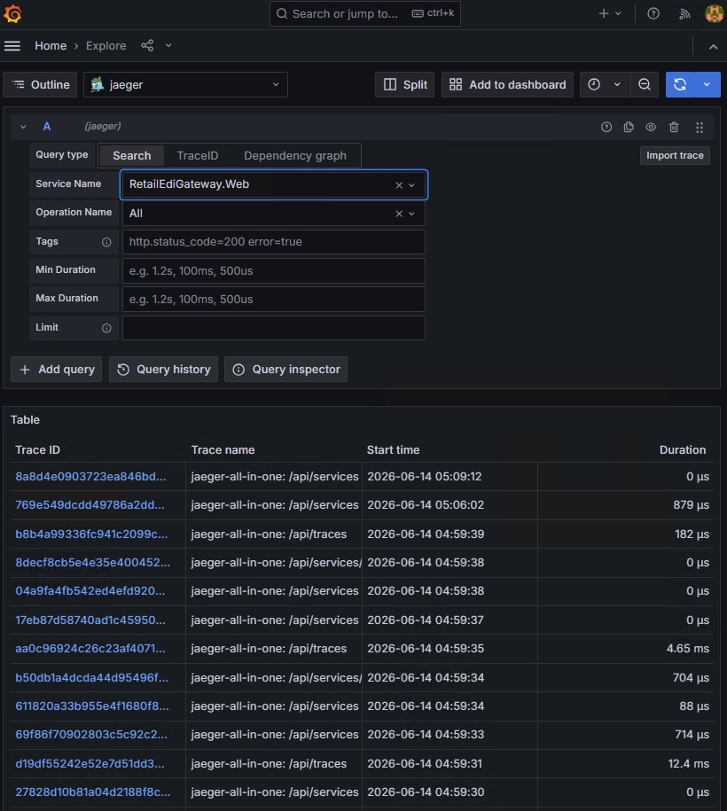
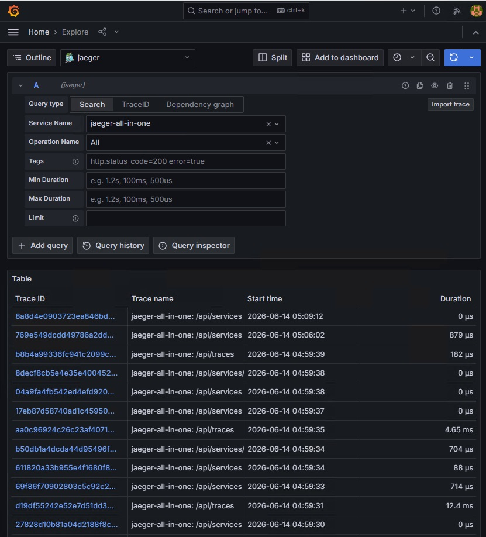
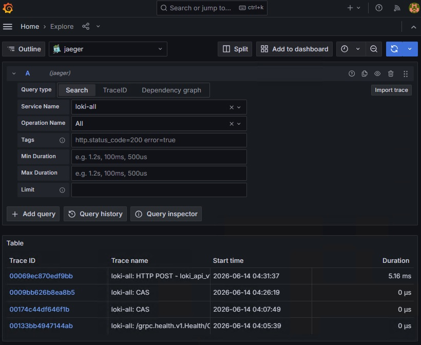
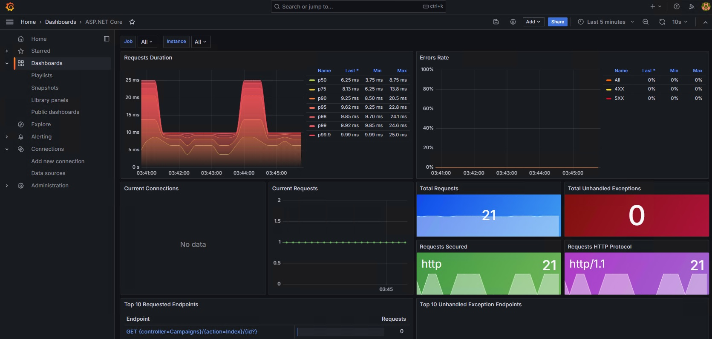
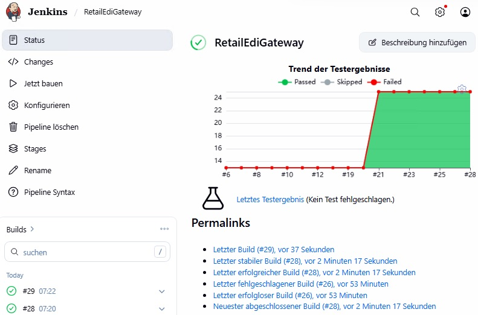
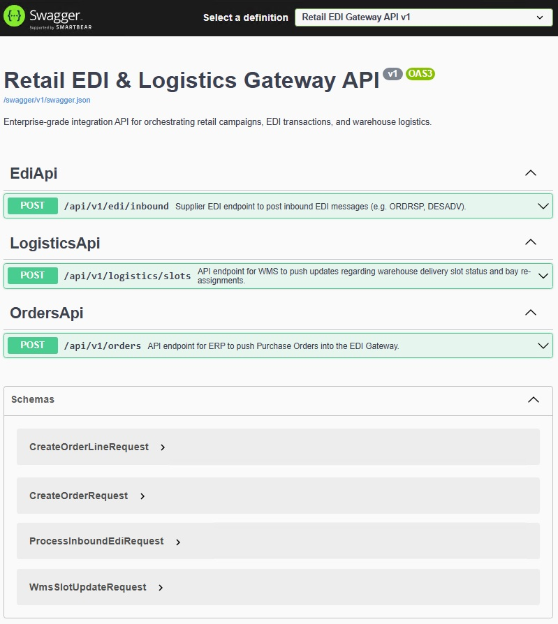
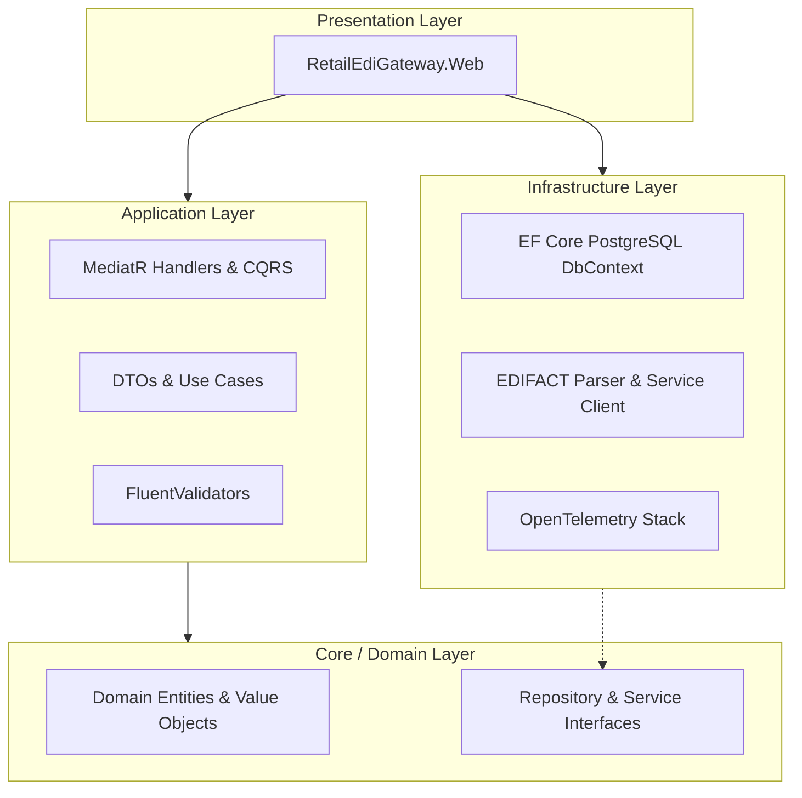
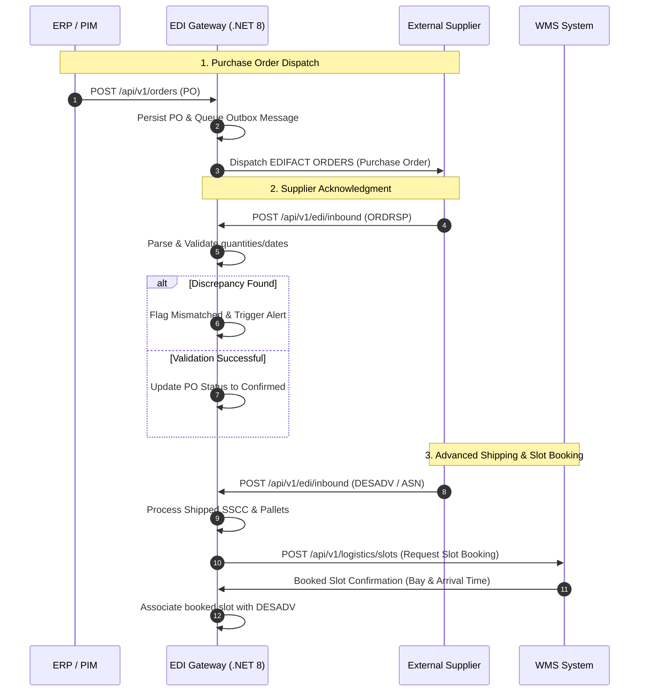
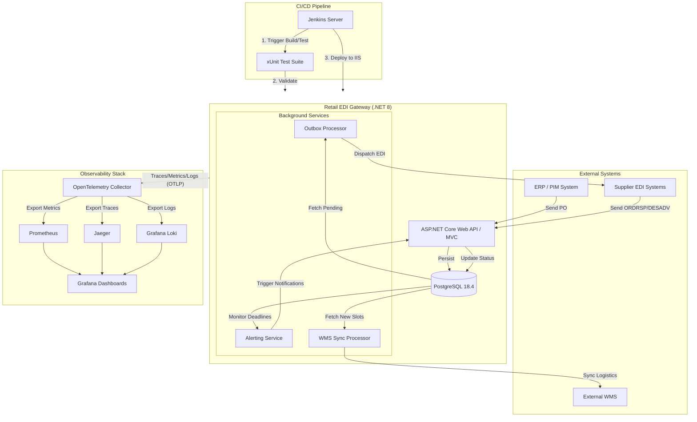

# EDI & Supply Chain Gateway

## 1. Overview
The **EDI & Supply Chain Gateway** is an enterprise-grade integration middleware designed to orchestrate electronic data exchange (EDI) with suppliers, specifically for high-priority temporary campaigns in retail environments.

It automates procurement, tracks shipping notifications, and manages warehouse slots to ensure on-time delivery for time-critical windows.

### Screenshots

#### Business Dashboards
| Campaign Monitor | WMS Unloading Schedule |
| :--- | :--- |
|  |  |

#### Observability & Monitoring (OpenTelemetry Stack)
| ASP.NET Core Metrics (Grafana) | Jaeger Traces |
| :--- | :--- |
|  |  |

| Grafana Loki Logs | Prometheus Dashboard |
| :--- | :--- |
|  |  |

#### CI/CD & API Documentation
| Jenkins CI/CD Pipeline | Swagger UI (API Docs) |
| :--- | :--- |
|  |  |

> **API Documentation:** The interactive Swagger UI is accessible at `/swagger` when running in `Development` mode.

## 2. Key Features
* **Campaign Tracking Dashboard:** Monitor fulfillment and delivery status of campaigns.
* **PO Processing:** Simulated outbound EDI transaction queuing (EDIFACT `ORDERS` placeholder).
* **Inbound Message Parsing:** Handle `ORDRSP` (Order Response) and `DESADV` (Despatch Advice) messages.
* **Warehouse Slot Management:** Coordinate truck arrival slots via internal reservation system.
* **WMS Sync Simulation:** Background processing of slot reservations with simulated external integration.
* **Proactive Alerting:** Flag missing responses, shipping delays, or quantity discrepancies.
* **API Security:** Hardened endpoints using API Key authentication.

## 3. Technology Stack
* **Framework:** .NET 8 (ASP.NET Core MVC)
* **Database:** PostgreSQL with Entity Framework Core (EF Core)
* **Observability:** OpenTelemetry (Prometheus metrics, Jaeger traces, Grafana logs/traces)
* **Architecture:** Clean Architecture (Core, Application, Infrastructure, Web layers)
* **Logging:** Serilog with structured logging
* **Testing:** xUnit, Moq, FluentAssertions (Mocking and Unit/Integration testing)

## 4. Environment & Infrastructure Setup

### 4.1 Database (Local PostgreSQL 18.4)
The project is configured to use a local PostgreSQL 18.4 instance.
* **Server:** `localhost:5432`
* **Database:** `edigateway`
* **Username:** `admin`
* **Password:** `adminpassword`

**Initialization:**
1. Create the database and user:
 ```sql
 CREATE USER admin WITH PASSWORD 'adminpassword' SUPERUSER;
 CREATE DATABASE edigateway OWNER admin;
 ```
2. Apply migrations (from the project root):
 ```powershell
 dotnet ef database update -project src\RetailEdiGateway.Infrastructure -startup-project src\RetailEdiGateway.Web
 ```

### 4.2 CI/CD (Jenkins & IIS)
The project includes a `Jenkinsfile` for automated build, test, and deployment to IIS.
* **Jenkins Pipeline:** Create a "Pipeline" project and link it to the Git repository.
* **Credentials:** Add a secret text credential with ID `PROD_DB_CONNECTION_STRING` containing the connection string.
* **IIS Deployment:** The pipeline automatically deploys to `C:\inetpub\wwwroot\RetailEdiGateway` using the `EdiGatewayPool` application pool.

### 4.3 IIS Production Configuration (Windows Server 2022)
For high-traffic production environments, the following IIS settings are recommended:
* **Application Pool:**
  * **Start Mode:** `AlwaysRunning`
  * **Idle Time-out (minutes):** `0` (Prevents the app from spinning down)
  * **Recycling:** Disable fixed intervals; use specific off-peak times (e.g., 03:00 AM).
* **Advanced Settings:**
  * **Preload Enabled:** `True` on the Site and Application level.
  * **Application Initialization:** Ensure the IIS module is installed to handle warm-up requests.

## 5. Getting Started

### Prerequisites
* **.NET 8 SDK**
* **PostgreSQL 16+** (PostgreSQL 18.4 recommended)
* **EF Core CLI Tools:** `dotnet tool install -global dotnet-ef`
* **Docker & Docker Compose:** Required for running the Observability Stack.

### Installation & Execution
1. **Observability Stack (Optional but Recommended):**
 Start the monitoring infrastructure (Prometheus, Jaeger, Loki, Grafana):
 ```powershell
 docker-compose up -d
 ```
 Access the dashboards at `http://localhost:3000` (Grafana).

2. **Restore & Build:**
 ```powershell
 dotnet restore
 dotnet build
 ```

2. **Run Locally:**
 Set the environment to `Development` to use the local database settings:
 ```powershell
 $env:ASPNETCORE_ENVIRONMENT='Development'
 dotnet run -project src\RetailEdiGateway.Web -urls "http://localhost:5000"
 ```

3. **Run Tests:**
 ```powershell
 dotnet test
 ```

## 6. Project Structure
* `src/RetailEdiGateway.Core`: Domain entities, enums, and core business rules.
* `src/RetailEdiGateway.Application`: Use cases (MediatR), interfaces, and application logic.
* `src/RetailEdiGateway.Infrastructure`: Database implementation (EF Core), external services, and background processors.
* `src/RetailEdiGateway.Web`: MVC/API Controllers, Views, and application configuration.
* `tests/`: Unit and integration tests.

## 7. Architecture & Data Flow

### 7.1 Clean Architecture Dependency Flow
The project is built following Clean Architecture principles, ensuring separation of concerns, testability, and independence from external frameworks:



### 7.2 End-to-End EDI and Supply Chain Flow
The gateway orchestrates communication between the internal ERP system, external suppliers, and the Warehouse Management System (WMS):



### 7.3 Microservices Architecture & Request Flow
The Gateway operates as a central hub within a distributed environment, coordinating with multiple external services while maintaining its own internal background processing, automated quality assurance, and observability stack.



## 8. Monitoring & Maintenance

### 8.1 Health Checks
The application exposes a health check endpoint at `/health`. It monitors:
* PostgreSQL connectivity.
* Background service status.
* Disk space on Windows Server.

### 8.2 Log Management
* **Location:** Logs are stored at `C:\Logs\EDIGateway\` on the Windows Server.
* **Rotation:** Managed by Serilog (`rollingInterval: RollingInterval.Day`).
* **Aggregation:** Shipped to Grafana Loki via OpenTelemetry.

### 8.3 Troubleshooting Common IIS Issues
* **503 Service Unavailable:** Check if the `EdiGatewayPool` AppPool has crashed (likely due to invalid DB credentials).
* **500.19 Internal Server Error:** Verify that the `web.config` is correct and the IIS URL Rewrite module is installed.
* **Performance Degradation:** Monitor the "Background workers" lag in Prometheus metrics; check for high DB connection pool usage.
